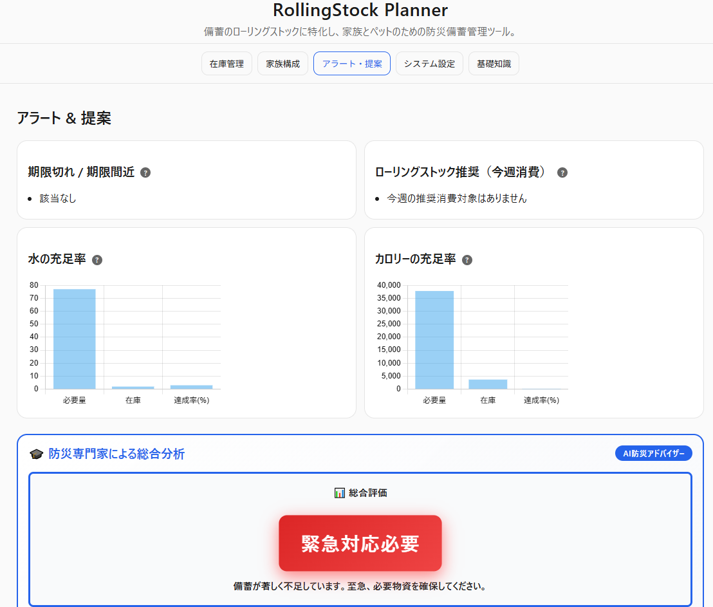

<!--
---
title: RollingStock Planner
category: survival
difficulty: 2
description: AI-powered rolling-stock disaster preparedness tool with family-based auto-calculation, 4-stage expiration alerts, and expert analysis. Features 13-section educational content, dark/light themes, XSS protection, and comprehensive data validation. Supports 3-day to 6-month stockpiling for humans and pets. 100% browser-based, privacy-first, open-source.
tags: [disaster-preparedness, survival, stock-management, rolling-stock, ai-advisor, javascript, education, prepper, dark-mode, security]
demo: https://ipusiron.github.io/rollingstock-planner/
---
-->

# RollingStock Planner - 防災備蓄管理ツール


[](https://ipusiron.github.io/rollingstock-planner/)

**Day096 - 生成AIで作るセキュリティツール100**

**RollingStock Planner** は、「備蓄を消費しながら補充する」**ローリングストック方式に完全特化**した、次世代の防災備蓄管理ツールです。

**防災アドバイザーによる分析機能**を搭載しており、現状の備蓄状況の問題点を洗い出してくれます。

---

## 🌐 デモページ

👉 **[https://ipusiron.github.io/rollingstock-planner/](https://ipusiron.github.io/rollingstock-planner/)**

ブラウザーで直接お試しいただけます。

---

## 📸 スクリーンショット

>
>*備蓄状況の分析結果*

---

## 🚀 主な特長

- 🤖 **AI防災アドバイザー搭載** - 備蓄状況を5つの観点から総合分析し、具体的なアクションを提案
- 👨‍👩‍👧‍👦 **家族構成別の自動計算** - 人間（成人・子ども・高齢者）+ ペット（犬・猫）の必要量を自動算出
- 🔄 **ローリングストック支援** - 14日以内に期限が来るアイテムを「今週消費」リストに自動掲載
- ⚠️ **4段階期限アラート** - 期限切れ・本日期限・要消費・OKを色分け表示（過去日付入力可）
- 🎓 **防災教育機能** - 13セクションの充実した基礎知識（アコーディオン形式）
- 🔒 **完全プライバシー保護** - すべてのデータはブラウザー内に保存、サーバー送信なし
- 📊 **プレッパー対応** - 3日〜半年（180日）までの長期備蓄計画に対応
- 🎨 **ダーク/ライトモード** - 見やすい配色で目に優しいインターフェイス

---

## 🎯 本ツールの独自性

既存の備蓄管理ツールとの決定的な違いは、 **「ローリングストック方式」に完全特化** し、**AI防災アドバイザーによる高度な分析機能**を搭載している点です。

### 他の備蓄管理ツールとの比較

| 機能 | 一般的な在庫管理アプリ | 本ツール（RollingStock Planner） |
|------|----------------------|--------------------------------|
| **ローリングストック対応** | ❌ 単なる期限管理のみ | ✅ 消費推奨リスト自動生成 |
| **家族構成別の自動計算** | ❌ 手動で計算が必要 | ✅ 人間+ペットの必要量を自動算出 |
| **AI分析・提案機能** | ❌ なし | ✅ 防災専門家による総合分析 |
| **防災教育機能** | ❌ なし | ✅ 座学タブで基礎知識を学習可能 |
| **データプライバシー** | ❌ サーバー保存が多い | ✅ 100%ブラウザー内保存 |
| **インストール** | ❌ アプリDLが必要 | ✅ ブラウザーで即利用可能 |
| **プレッパー対応** | ❌ 短期備蓄のみ | ✅ 半年（180日）まで対応 |
| **費用** | ❌ 有料が多い | ✅ 完全無料・オープンソース |

### 独自機能の詳細

#### 1. 🔄 ローリングストック方式の完全サポート

「買って放置」ではなく、**「消費しながら補充する」循環型備蓄**を実現。

- 14日以内に期限が来るアイテムを「今週消費」リストに自動掲載
- 賞味期限が近い順に優先表示し、食品ロスを最小化
- 補充推奨アラートで「常に新鮮な備蓄」を維持

#### 2. 🤖 AI防災アドバイザーによる総合分析

他ツールにはない、**専門家レベルの分析・提案機能**。

- **5段階評価**：総合評価・水食料充足・期限管理・カテゴリバランス・具体的アクションを自動分析
- **緊急度の可視化**：不足が深刻な場合、パルス効果で視覚的に警告
- **パーソナライズ提案**：家族構成（子ども・高齢者・ペット）に応じた個別アドバイス
- **具体的な購入推奨**：「2Lペットボトル〇本分」「缶詰〇個分」など実用的な指標

#### 3. 👨‍👩‍👧‍👦 家族構成ベースの自動計算

**人間だけでなくペットも含めた**家族全体の必要量を自動算出。

- 成人・子ども・高齢者で異なる水量・カロリー基準
- 犬・猫の水分必要量も考慮
- 3日〜半年（180日）まで、想定日数を自由に設定可能

#### 4. 🎓 防災教育も統合

備蓄管理だけでなく、**防災の考え方・倫理的判断**まで学べる充実した13セクション。

- **基本方針**（在宅避難 vs 避難所避難、ローリングストックの3原則）
- **備蓄期間の考え方**（3日/7日/14日/1ヶ月/3ヶ月/半年の目的別ガイド）
- **ローリングストック実践**（週次・月次のサイクル、家族協力のコツ）
- **保管場所の工夫**（分散保管、温度・湿度管理、防虫・防鼠対策）
- **栄養バランス**（PFC比率、ビタミン・ミネラル、塩分管理）
- **賞味期限 vs 消費期限**（違いと判断基準）
- **調理方法**（火・水なし調理、ポリ袋調理、アルファ米の活用）
- **ペット避難**（同行避難の準備、ケージ訓練、必要物資）
- **子ども・高齢者対策**（離乳食、介護食、常備薬の管理）
- **季節別備蓄**（夏季の熱中症対策、冬季の防寒対策）
- **倫理的ジレンマ**（「隣人に食料を求められたら？」「ペット同伴拒否されたら？」など）
- **災害シナリオ別対応**（地震・台風・水害・停電の優先備蓄）
- **よくある失敗例**（賞味期限切れ放置、偏った備蓄、家族への周知不足など）

全セクションがアコーディオン形式で、必要な情報を素早く参照可能。

#### 5. 🔒 プライバシー最優先設計

すべてのデータは**ブラウザー内のLocalStorageに保存**。

- サーバーへの送信は一切なし
- アカウント登録不要
- インターネット接続不要（オフラインでも動作）
- データのエクスポート/インポートで完全にユーザー管理

#### 6. 🌍 プレッパー（長期備蓄愛好家）にも対応

一般家庭向けの3〜14日だけでなく、**半年（180日）までの長期備蓄**計画にも対応。

- 3ヶ月・6ヶ月の警告閾値設定
- 大量アイテムのページネーション対応
- カテゴリ別バランス分析で偏りを防止

---

## 👥 対象ユーザー

このツールは、以下のような方々を対象としています：

- **家庭で防災対策をしている方**
  日常的に備蓄を管理し、ローリングストックを実践したい個人・家族

- **ペットと暮らしている方**
  犬・猫などのペットの水・食料も含めた備蓄計画を立てたい飼い主

- **小さな子どもがいる家庭**
  子どもの年齢に応じた必要量を自動計算し、適切な備蓄を確保したい家族

- **高齢者を介護している方**
  高齢者の特別な栄養・水分ニーズを考慮した備蓄管理が必要な介護家族

- **一人暮らしの方**
  最小限の備蓄から始めたい単身世帯や、自分専用の備蓄計画を立てたい方

- **プレッパー（備蓄愛好家）**
  長期的な備蓄を計画的に管理し、様々なシナリオに備えたい実践者

- **防災教育に関わる方**
  学校・専門学校での防災授業や、地域の防災講習で使用したい教育者・防災士

- **自主防災組織のメンバー**
  地域の防災啓発活動や、共同備蓄の計画立案に活用したい方

- **企業の総務・危機管理担当者**
  オフィスや事業所での備蓄管理、従業員の防災意識向上に役立てたい方

---

## 💡 活用シナリオ

### シナリオ1：プレッパーによる長期備蓄の体系的管理

**ユーザー**: 都市部在住の30代会社員・プレッパー歴3年

**課題**:
- 3ヶ月分の食料・水を備蓄しているが、賞味期限管理が煩雑
- 様々なカテゴリ（主食・副食・水・医薬品・日用品）の在庫バランスが把握しづらい
- 期限切れによる廃棄を最小化したい

**活用方法**:
1. **初期登録**: 備蓄している全アイテム（缶詰50種、レトルト30種、水24L等）をモーダルUIから一括登録
2. **警告閾値設定**: システム設定タブで警告閾値を「3ヶ月」に設定し、早めの消費・補充サイクルを確立
3. **ローリングストック実践**: アラート・提案タブで「今週消費」リストを確認し、日常食に組み込む
4. **定期エクスポート**: 月1回データをエクスポートし、バージョン管理で備蓄の変遷を記録
5. **シナリオ別計算**: 家族構成タブで想定日数を「14日→30日→90日」と変更し、各シナリオでの充足率を検証

**成果**:
- 賞味期限切れによる廃棄が月平均8%→1%未満に削減
- カテゴリ別の在庫バランスが可視化され、偏りを是正
- 家族（配偶者・子ども2人）全員分の3ヶ月備蓄を確実に維持

---

### シナリオ2：共働き家庭のローリングストック入門

**ユーザー**: 4人家族（夫婦・小学生2人）の共働き世帯

**課題**:
- 防災の必要性は感じているが、何から始めればいいかわからない
- 備蓄品を買っても賞味期限を忘れて無駄にしてしまう
- 忙しくて備蓄管理に時間をかけられない

**活用方法**:
1. **家族構成登録**: 家族構成タブで「成人2人・子ども2人・想定7日」を入力し、必要量を自動計算
2. **買い物リスト作成**: 水48L、カロリー52,800kcal必要と判明。不足分をリストアップ
3. **スーパーで購入**: 日常の買い物ついでに、缶詰・レトルト・ペットボトル水を追加購入
4. **スマホで登録**: 帰宅後、モーダルUIから5分で全アイテムを登録（単位プリセット活用、賞味期限も入力）
5. **週次チェック**: 毎週日曜の夕食時、アラート・提案タブで「期限間近」を確認し、翌週の献立に組み込む

**成果**:
- 初期投資1.5万円で7日分の備蓄を構築
- 月1回の補充サイクルで、常に新鮮な備蓄を維持
- 子どもたちの防災意識も向上（「今日は備蓄カレーの日」と楽しみに）

---

### シナリオ3：地域防災組織での啓発ツールとしての活用

**ユーザー**: 自主防災組織の防災リーダー（60代・防災士資格保持）

**課題**:
- 地域住民（特に若年層）の防災意識が低い
- 「備蓄は大変」というイメージで、実践のハードルが高い
- 講習会で具体的なツールを紹介したい

**活用方法**:
1. **講習会デモ**: プロジェクターでツールを投影し、実際にアイテムを登録するデモを実施
2. **ハンズオン体験**: 参加者が自分のスマホでツールを開き、架空の家族構成で必要量を計算
3. **座学タブ活用**: 基礎知識タブの13セクションを使って、倫理的ジレンマ（「隣人に食料を求められたら？」）をディスカッション
4. **継続サポート**: 講習会後、QRコードでツールURLを配布。1ヶ月後にフォローアップ
5. **事例共有**: 実践している住民の体験談を次回講習会で紹介

**成果**:
- 講習会参加者30名中、18名が実際にツールを使い始める
- 地域の備蓄実践率が推定15%→35%に向上
- 若年層（20-40代）の参加が増加（「アプリ感覚で使える」と好評）

---

## 🗂️ タブ構成

| タブ名 | 機能概要 |
|--------|-----------|
| **在庫管理** | モーダルUIで食料・水・医薬品・日用品などを登録（単位プリセット・期限リセット/なしボタン付き）。4段階ステータスバッジ（🔴期限切れ/🟠本日期限/🟡要消費/🟢OK）で期限を色分け警告。備蓄品カテゴリ別の割合を円グラフで可視化。検索・ソート・ページネーション（50件/ページ）対応。 |
| **家族構成** | 家族人数（成人・子ども・高齢者）とペット（犬・猫）を3つのセクションに分けて設定。必要な水量・カロリーを自動計算し、3日/7日/14日/30日/半年（180日）の想定日数に対応。 |
| **アラート・提案** | 期限切れ/期限間近リスト、ローリングストック推奨（今週消費）、水・カロリー充足率グラフを表示。<br>**🤖 AI防災アドバイザー**が5つの観点（総合評価・充足状況・期限管理・カテゴリバランス・具体的アクション）から総合分析し、緊急度を視覚的に強調（グレード評価・パルスアニメーション）。 |
| **システム設定** | 警告閾値の設定（1/2/3/6ヶ月）、データのエクスポート/インポート（JSONファイル、タイムスタンプ付き、最大10MB）、全アイテム削除などの管理機能。 |
| **基礎知識** | 13セクションの充実した防災知識をアコーディオン形式で提供。基本方針（在宅避難 vs 避難所避難）、ローリングストック実践、保管場所、栄養バランス、調理方法、ペット避難、子ども・高齢者対策、季節別備蓄、倫理的ジレンマ（「隣人に食料を求められたら？」など）、よくある失敗例など。 |

---

## 📊 期限ステータスバッジの種類と判定ロジック

在庫管理タブでは、各アイテムの消費/使用期限に応じて4種類のステータスバッジが自動表示されます。

| バッジ | 色 | 判定条件 | 説明 |
|--------|------|----------|------|
| **期限切れ** | 🔴 赤 | 昨日以前が期限日 | 賞味/消費期限が過ぎています。至急確認し、処分または消費を検討してください。 |
| **本日期限** | 🟠 橙 | 今日が期限日 | 本日が期限日です。速やかに消費または適切に処理してください。 |
| **要消費** | 🟡 黄 | 警告閾値以内（デフォルト2ヶ月） | 期限が警告閾値内に到来します。計画的に消費し、ローリングストックを実践しましょう。 |
| **OK** | 🟢 緑 | 警告閾値を超えている | 期限まで余裕があります。適切に保管し、定期的に確認してください。 |

### 判定ロジックの詳細

```
今日の日付を基準に、以下の順で判定：

1. 期限日 < 今日の0時 → 🔴 期限切れ
2. 期限日 = 今日 → 🟠 本日期限
3. 期限日 ≤ 今日 + 警告閾値（月数） → 🟡 要消費
4. 上記以外 → 🟢 OK
```

**注意事項**：
- 期限日は「YYYY-MM-DD」形式（ISO 8601）で入力してください
- 過去の日付も入力可能（すでに期限切れのアイテムを記録する場合）
- 警告閾値は「システム設定」タブで変更可能（1ヶ月/2ヶ月/3ヶ月/6ヶ月）
- 期限なしの場合は「—」と表示されます

---

## 🍱 基本的な防災セット（座学タブより抜粋）

以下は、家庭備蓄の基本を学ぶチェックリストです。

| カテゴリ | 内容 | 推奨備蓄期間 |
|-----------|------|--------------|
| 飲料水 | 1人1日4Lを目安。避難3日、自宅避難なら2週間分。 | 3〜14日分 |
| 食料 | 加熱不要・保存性の高い食品（缶詰・レトルトなど）。 | 3〜14日分 |
| 医薬品 | 常備薬、救急セット、マスク、7日分以上の備え。 | 1〜2週間 |
| 情報手段 | 手回しラジオ、懐中電灯、モバイル電源。 | 長期保管可 |
| 生活用品 | トイレットペーパー、石けん、生理用品など。 | 2週間分 |
| 書類 | 保険証、パスポート、緊急連絡先のコピー。 | 常時携行 |
| 現金・口座情報 | 紙幣・銀行番号・カード番号控え。 | 常時保管 |
| ペット用品 | 餌・水・排泄用品・キャリーケース。 | 3〜7日分 |
| 避難計画 | 地図・避難経路の明示。 | 家族で共有 |

>※出典：防災教育資料『あなたのための防災セット』より整理

---

## ⚖️ 倫理的ジレンマと行動指針

> **Q：隣人に食料を求められたら？**  
> A：まず自分と家族の生命維持を優先する。しかし、地域の連携が生死を分ける場合もある。  
> 単なる「分け与える／拒む」二択ではなく、**共同調理・情報共有** などの中間的選択肢も視野に。

> **Q：避難所でペットはどうする？**  
> A：同行避難の可否を自治体サイトで事前確認。避難バッグにペット食料・水・医薬品を同梱。

> **Q：籠城と避難、どちらを選ぶ？**  
> A：安全が確保されているなら在宅避難が基本。だがライフライン断絶が長期化する場合は早期避難を判断。

---

## 💾 技術仕様

- **フロントエンド**：HTML5 / CSS3 / JavaScript（Vanilla、フレームワーク不使用）
- **データ保存**：ブラウザーのLocalStorage（サーバー送信なし）
- **グラフ描画**：Chart.js（カテゴリ別円グラフ、充足率棒グラフ）
- **レスポンシブ対応**：PC・タブレット・スマートフォン全対応
- **テーマ機能**：ダークモード / ライトモード切り替え（設定保存）
- **セキュリティ**：
  - XSS防止（escapeHtml関数による全入力サニタイズ）
  - 入力検証（カテゴリホワイトリスト、文字数制限、数値範囲チェック）
  - ファイルサイズ制限（インポート時10MB上限）
  - セキュリティヘッダー（X-Content-Type-Options, X-Frame-Options, Referrer-Policy）
- **データ管理**：
  - JSON形式でのエクスポート/インポート（タイムスタンプ付きファイル名）
  - データ検証機能（不正データの自動修正・除外）
  - ページネーション（50件/ページ）
  - 検索・ソート機能（期限順、名前順、カテゴリ順）

---

## 🔧 開発者向け情報

技術的な実装詳細、アルゴリズム解説、セキュリティ設計については、以下のドキュメントを参照してください：

👉 **[TECHNICAL.md - 技術詳細ドキュメント](TECHNICAL.md)**

**主なトピック**：
- セキュリティ実装（XSS対策、入力検証、ホワイトリスト方式）
- 4段階期限判定アルゴリズム
- AI防災アドバイザーのスコアリングロジック
- 必要量計算アルゴリズム
- テーマシステムとChart.js統合
- レスポンシブツールチップ実装
- データ永続化と検証
- ページネーション実装
- パフォーマンス最適化

---

## 🔗 関連知識

- 内閣府「防災の手引き」
- 消費者庁「ローリングストックで日常から備える」
- 赤十字「家庭防災チェックリスト」

---

## 📘 教育活用例

- 高校・専門学校での防災教育授業  
- 自治体や防災士講習の教材  
- 家族会議や地域防災訓練での実践シミュレーター  

---

## 📁 ディレクトリー構成

```
rollingstock-planner/
├── index.html          # メインHTML（シングルページアプリ）
├── script.js           # アプリケーションロジック（在庫管理・計算・描画）
├── style.css           # スタイルシート（ダーク/ライトモード・レスポンシブ対応）
├── assets/             # 画像・アイコン類
│   └── screenshot.png  # スクリーンショット
├── README.md           # プロジェクト説明
├── TECHNICAL.md        # 技術詳細ドキュメント（開発者向け）
├── CLAUDE.md           # Claude Code向けガイド
├── LICENSE             # MITライセンス
├── .gitignore          # Git除外設定
└── .nojekyll           # GitHub Pages設定
```

---

## 📄 ライセンス

MIT License – 詳細は [LICENSE](LICENSE) を参照してください。

---

## 🛠️ このツールについて

本ツールは、「生成AIで作るセキュリティツール100」プロジェクトの一環として開発されました。
このプロジェクトでは、AIの支援を活用しながら、セキュリティに関連するさまざまなツールを100日間にわたり制作・公開していく取り組みを行っています。

プロジェクトの詳細や他のツールについては、以下のページをご覧ください。

🔗 [https://akademeia.info/?page_id=42163](https://akademeia.info/?page_id=42163)
